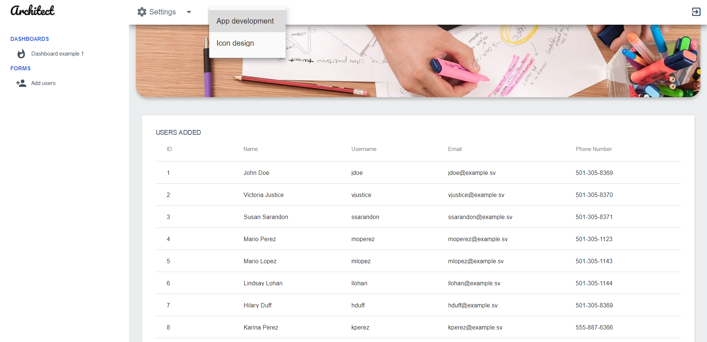

<h1>Datatable Example for Flutter</h1>

A quick example on how to get data from an API and show it in a datatable widget, in Flutter Web.

As always, this template will be unusuable in mobile devices, and that is on purpose.
